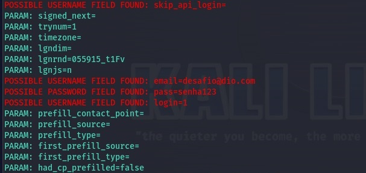

# cibersecurity-desafio-phishing
Para o desafio de phishing no Kali Linux, segui o passo a passo, mas encontrei um problema com os navegadores atuais que não permitem a captura do nome de usuário e senha no clone do site do Facebook. Resolvi esse problema utilizando um navegador do Windows 7 na máquina virtual instalada.

Criação de um phishing para captura de senha, usando o Kali Linux.
## Passo a passo
### Ferramentas

- Kali Linux
- setoolkit

### Configurando o Phishing no Kali Linux

- Acesso root: ``` sudo su ```
- Iniciando o setoolkit: ``` setoolkit ```
- Tipo de ataque: ``` Social-Engineering Attacks ```
- Vetor de ataque: ``` Web Site Attack Vectors ```
- Método de ataque: ```Credential Harvester Attack Method ```
- Método de ataque: ``` Site Cloner ```
- Obtendo o endereço da máquina: ``` ifconfig ```
- URL para clone: http://www.facebook.com

### Resutados

